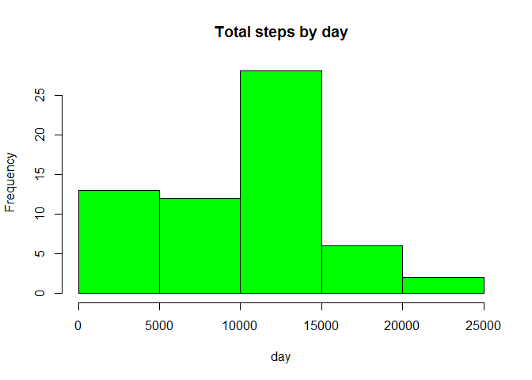

# Reproducible Research: Peer Assessment 1

## Loading and preprocessing the data
### 1. Load the data (read csv)


```r
activity <- read.csv("activity.csv", colClasses = c("numeric", "character", 
    "numeric"))
head(activity)
```

```
##   steps       date interval
## 1    NA 2012-10-01        0
## 2    NA 2012-10-01        5
## 3    NA 2012-10-01       10
## 4    NA 2012-10-01       15
## 5    NA 2012-10-01       20
## 6    NA 2012-10-01       25
```

```r
names(activity)
```

```
## [1] "steps"    "date"     "interval"
```

### 2. Process/transform the data (if necessary) into a format suitable for your analysis


```r
library(lattice)
activity$date <- as.Date(activity$date, "%Y-%m-%d")
```

## What is mean total number of steps taken per day?
### A. Using aggregate function

```r
StepsTotal <- aggregate(steps ~ date, data = activity, sum, na.rm = TRUE)
```

### 1. The Histogram of the total number of steps taken each day

```r
hist(StepsTotal$steps, main = "Total steps by day", xlab = "day", col = "red")
```

 

### 2. Mean and median total number of steps taken per day

```r
mean(StepsTotal$steps)
```

```
## [1] 10766.19
```

```r
median(StepsTotal$steps)
```

```
## [1] 10765
```

### B. Make a data frame with the values to create a data frame with the days and the total of steps by day

```r
steps <- rep(NA, 61)
day <- rep("NA", 61)
stepsday <- tapply(activity$steps, activity$date, sum, na.rm = T)
length(stepsday)
```

```
## [1] 61
```


```r
for (i in 1:61) {
    steps[i] <- stepsday[[i]]
    day[i] <- names(stepsday)[i]
}

df <- data.frame(day, steps)
head(df)
```

```
##          day steps
## 1 2012-10-01     0
## 2 2012-10-02   126
## 3 2012-10-03 11352
## 4 2012-10-04 12116
## 5 2012-10-05 13294
## 6 2012-10-06 15420
```

## Histogram as below

```r
hist(df$steps, main = "Total steps by day", xlab = "day", col = "green")
```

 

## What is the average daily activity pattern?
### 1. Make a time series plot (i.e. type = "l") of the 5-minute interval (x-axis) and the average number of steps taken, averaged across all days (y-axis)

```r
time_series <- tapply(activity$steps, activity$interval, mean, na.rm = TRUE)

plot(row.names(time_series), time_series, type = "l", xlab = "5-min interval", 
    ylab = "Average across all Days", main = "Average number of steps taken", 
    col = "red")
```

 

### 2. Which 5-minute interval, on average across all the days in the dataset, contains the maximum number of steps?

```r
max_interval <- which.max(time_series)
names(max_interval)
```

```
## [1] "835"
```

## Imputing missing values
### 1. Calculate and report the total number of missing values in the dataset (i.e. the total number of rows with NAs)

```r
activity_NA <- sum(is.na(activity))
activity_NA
```

```
## [1] 2304
```

### 2. Devise a strategy for filling in all of the missing values in the dataset. The strategy does not need to be sophisticated. For example, you could use the mean/median for that day, or the mean for that 5-minute interval,etc
###   Na replaced by mean in 5 min interval

```r
StepsAverage <- aggregate(steps ~ interval, data = activity, FUN = mean)
fillNA <- numeric()
for (i in 1:nrow(activity)) {
    obs <- activity[i, ]
    if (is.na(obs$steps)) {
        steps <- subset(StepsAverage, interval == obs$interval)$steps
    } else {
        steps <- obs$steps
    }
    fillNA <- c(fillNA, steps)
}
```

### 3. Create a new dataset that is equal to the original dataset but with the missing data filled in.

```r
new_activity <- activity
new_activity$steps <- fillNA
```

### 4. Make a histogram of the total number of steps taken each day and Calculate and report the mean and median total number of steps taken per day. Do these values differ from the estimates from the first part of the assignment? What is the impact of imputing missing data on the estimates of the total daily number of steps?

```r
StepsTotal2 <- aggregate(steps ~ date, data = new_activity, sum, na.rm = TRUE)
```

###  The histogram as below.

```r
hist(StepsTotal2$steps, main = "Total steps by day", xlab = "day", col = "red")
```

 

### Mean of total steps taken per day

```r
mean(StepsTotal2$steps)
```

```
## [1] 10766.19
```

### Median of total steps taken per day

```r
median(StepsTotal2$steps)
```

```
## [1] 10766.19
```

## Are there differences in activity patterns between weekdays and weekends?
### 1. Create a new factor variable in the dataset with two levels – “weekday” and “weekend” indicating whether a given date is a weekday or weekend day.

```r
day <- weekdays(activity$date)
daylevel <- vector()
for (i in 1:nrow(activity)) {
    if (day[i] == "Saturday") {
        daylevel[i] <- "Weekend"
    } else if (day[i] == "Sunday") {
        daylevel[i] <- "Weekend"
    } else {
        daylevel[i] <- "Weekday"
    }
}
activity$daylevel <- daylevel
activity$daylevel <- factor(activity$daylevel)

stepsByDay <- aggregate(steps ~ interval + daylevel, data = activity, mean)
names(stepsByDay) <- c("interval", "daylevel", "steps")
```

### 2. Make a panel plot containing a time series plot (i.e. type = "l") of the 5-minute interval (x-axis) and the average number of steps taken, averaged across all weekday days or weekend days (y-axis). The plot should look something like the following, which was creating using simulated data.

```r
xyplot(steps ~ interval | daylevel, stepsByDay, type = "l", layout = c(1, 2), 
    xlab = "Interval", ylab = "Number of steps")
```

 
